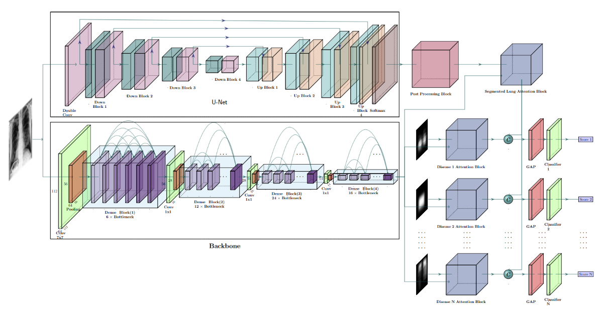

# ThoraX-PriorNet: A Novel Attention-Based Architecture Using Anatomical Prior Probability Maps for Thoracic Disease Classification [[IEEE Access](https://ieeexplore.ieee.org/document/10371304)]



# Introduction
Computer-aided disease diagnosis and prognosis based on medical images is a rapidly emerging field. Many Convolutional Neural Network (CNN) architectures have been developed by researchers for disease classification and localization from chest X-ray images. It is known that different thoracic disease lesions are more likely to occur in specific anatomical regions compared to others. This article aims to incorporate this disease and region-dependent prior probability distribution within a deep learning framework. We present the ThoraX-PriorNet, a novel attention-based CNN model for thoracic disease classification. We first estimate a disease-dependent spatial probability, i.e., an anatomical prior, that indicates the probability of occurrence of a disease in a specific region in a chest X-ray image. Next, we develop a novel attention-based classification model that combines information from the estimated anatomical prior and automatically extracted chest region of interest (ROI) masks to provide attention to the feature maps generated from a deep convolution network. Unlike previous works that utilize various self-attention mechanisms, the proposed method leverages the extracted chest ROI masks along with the probabilistic anatomical prior information, which selects the region of interest for different diseases to provide attention. The proposed method shows superior performance in disease classification on the NIH ChestX-ray14 dataset compared to existing state-of-the-art methods while reaching an area under the ROC curve (%AUC) of 84.67. Regarding disease localization, the anatomy prior attention method shows competitive performance compared to state-of-the-art methods, achieving an accuracy of 0.80, 0.63, 0.49, 0.33, 0.28, 0.21, and 0.04 with an Intersection over Union (IoU) threshold of 0.1, 0.2, 0.3, 0.4, 0.5, 0.6, and 0.7, respectively. The proposed ThoraX-PriorNet can be generalized to different medical image classification and localization tasks where the probability of occurrence of the lesion is dependent on specific anatomical sites.

# Dependencies
- pytorch (2.0.1)
- albumentations (1.3.1)
- python (3.9.12)
- timm (0.9.2)

The code is developed in the following hardware and OS setting:
- Ubuntu 20.04.5 LTS OS
- GeForce RTX A4500 GPU
- Intel Core i9-10920X CPU
- 128 GB System Memory

# Datasets
- [NIH Chest X-ray14](https://www.kaggle.com/datasets/nih-chest-xrays/data)

# Usage
To train the model:
```
python main.py --gpu_ids='0,1,2,3' --n_workers=16 --batch_size=16 --do_grad_accum=True --grad_accum_step=8 --image_resize_dim=586 --image_crop_dim=512
```
To test the model:
```
python test.py --gpu_ids='0,1,2,3' --n_workers=16 --batch_size=16 --image_resize_dim=586 --image_crop_dim=512
```
```
python test_tta.py --gpu_ids='0,1,2,3' --n_workers=8 --batch_size=8 --image_resize_dim=586 --image_crop_dim=512
```

# Citation
To cite this article in your publications, please use the following bibtex entry
```
@ARTICLE{10371304,
  author={Hossain, Md. Iqbal and Zunaed, Mohammad and Ahmed, Md. Kawsar and Hossain, S. M. Jawwad and Hasan, Anwarul and Hasan, Taufiq},
  journal={IEEE Access}, 
  title={ThoraX-PriorNet: A Novel Attention-Based Architecture Using Anatomical Prior Probability Maps for Thoracic Disease Classification}, 
  year={2024},
  volume={12},
  number={},
  pages={3256-3273},
  keywords={Diseases;Lung;X-ray imaging;Location awareness;Lesions;Feature extraction;Probabilistic logic;Anatomy;Classification algorithms;Anatomical prior;anatomy-aware attention;chest X-ray;thoracic disease classification},
  doi={10.1109/ACCESS.2023.3346315}
}
```

# Contact
rafizunaed@gmail.com <br>
Any discussions, suggestions and questions are welcome!

# Repo still under development